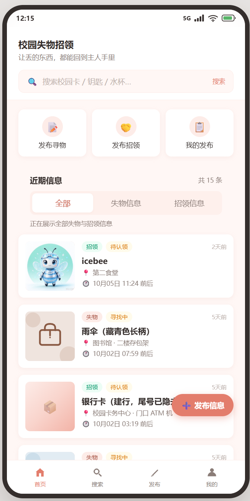
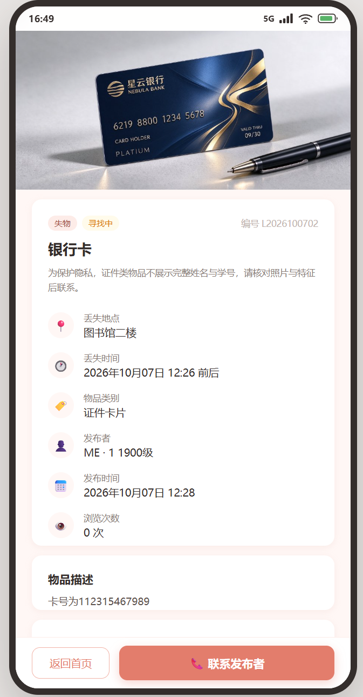
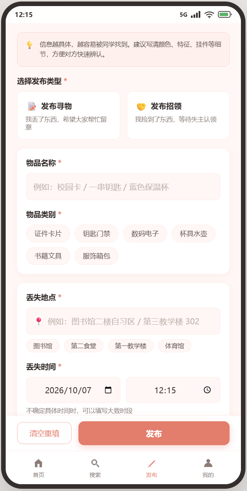
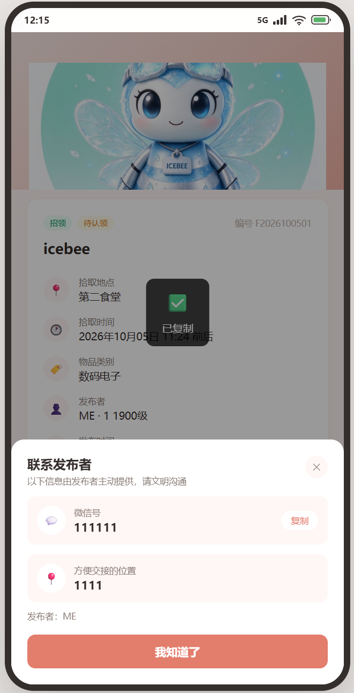
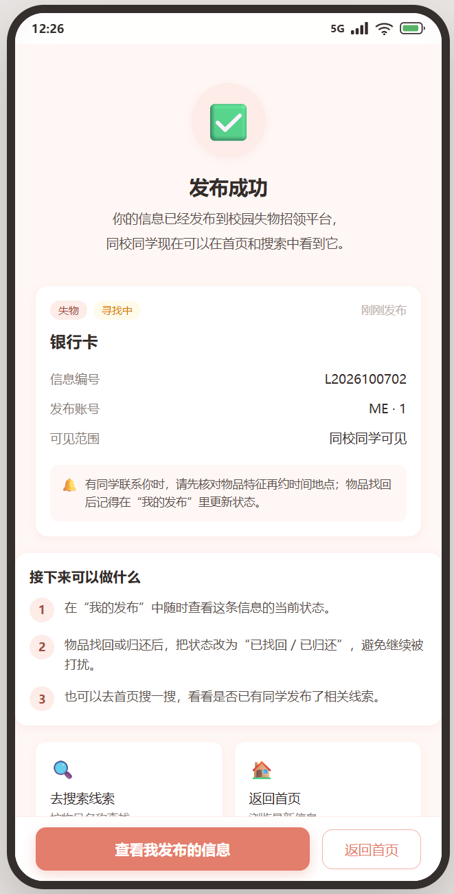
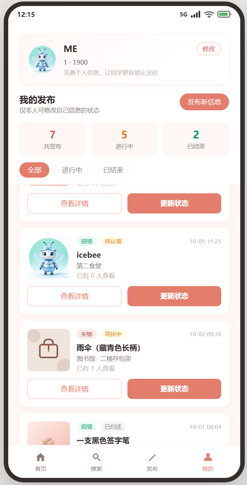
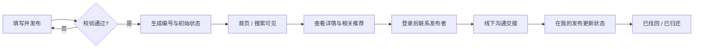
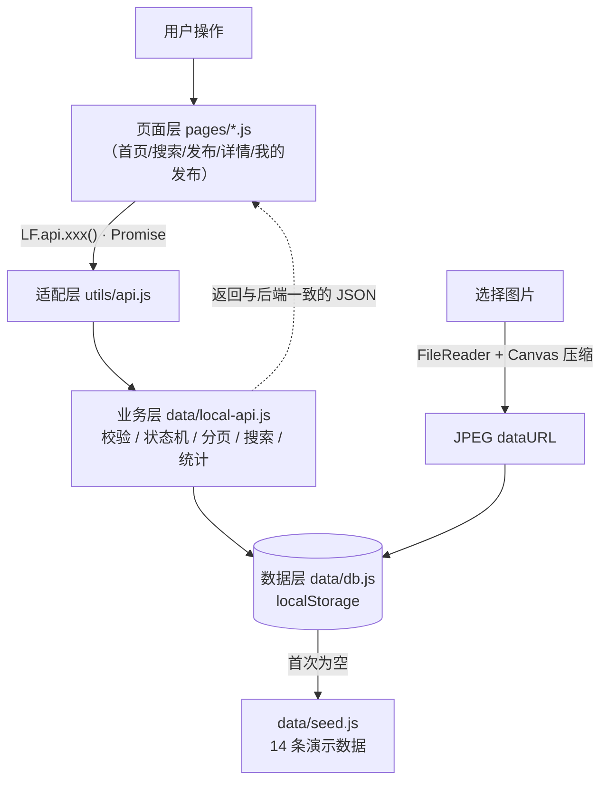
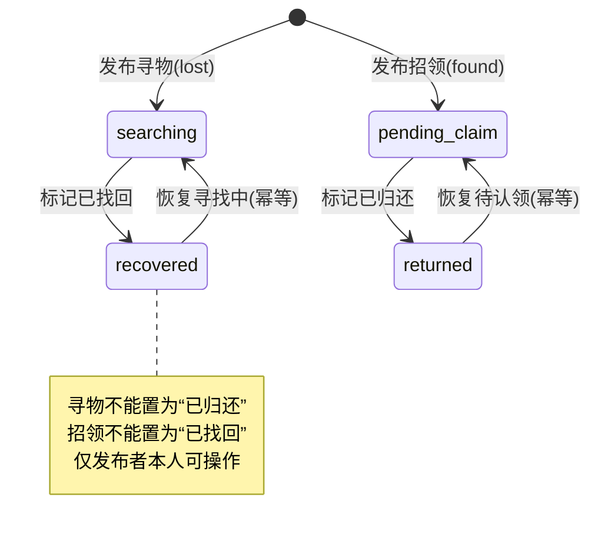

<a id="readme-top"></a>

<div align="center">

<!-- 可选：把一张横幅图命名为 docs/banner.png 后取消下一行注释 -->
<!--  -->

<h1>🏫 校园失物招领平台</h1>

<h3>丢了东西有人帮，捡到东西能归还 —— 一个开箱即用、零后端依赖的 Web 版校园失物招领</h3>

<p>
  
  
  
  = 18" />
  
  
</p>

<p>
  
  
  
  
  
</p>

<p>
  <a href="#features">功能特性</a> ·
  <a href="#quick-start">快速开始</a> ·
  <a href="#architecture">项目架构</a> ·
  <a href="#directory">目录结构</a> ·
  <a href="#testing">单元测试</a> ·
  <a href="#api-map">接口对照</a>
</p>
</div>

---

## 📖 项目简介

这是《软件工程》课程**第四次结对作业**的 Web 端作品，实现了「**发布信息 → 浏览 / 搜索 → 查看详情 → 联系发布者 → 更新状态**」的完整失物招领闭环。

为了让老师和同学**下载后无需配置 JDK / 数据库、用浏览器打开就能看到预期效果**，本版本在保留真实前后端分离项目的页面、接口契约与业务规则的前提下，用一层「**浏览器内本地数据层**」替代了远程后端：

- 🚫 **无需启动后端、无需数据库、无需 `npm install`**；
- 💾 数据通过 **localStorage** 持久化，刷新不丢失、不联网；
- 🔌 页面只面向统一的 `LF.api` 接口编程，将来接回真实后端时**页面零改动**（详见[架构说明](#architecture)）。

> 📱 采用移动端风格单页应用（hash 路由），开发与演示统一使用 **Google Chrome** 浏览器。

---

<a id="features"></a>

## 📸 效果展示

<p align="center">
   &nbsp;
   &nbsp;
  
</p>
<p align="center">
   &nbsp;
   &nbsp;
  
</p>

<div align="center">
<sub>首页　·　详情　·　发布　·　联系发布者　·　发布成功　·　我的发布</sub>
</div>

## ✨ 功能特性

<table>
<tr>
<td valign="top" width="50%">

<h4>🔍 浏览与搜索</h4>
<ul>
<li>首页<b>失物 / 招领</b>分类切换、触底分页加载</li>
<li>关键词同时匹配<b>名称 / 地点 / 描述 / 编号</b>，自动去除首尾空格</li>
<li>热门搜索词、空结果推荐与引导</li>
</ul>
</td>
<td valign="top" width="50%">

<h4>📄 详情与推荐</h4>
<ul>
<li>图片<b>轮播预览</b>，点击查看大图</li>
<li>浏览量统计、同类型<b>相关推荐</b>（进行中优先）</li>
<li>证件类物品<b>隐私提示</b>，敏感信息脱敏</li>
</ul>
</td>
</tr>
<tr>
<td valign="top">

<h4>📝 发布信息</h4>
<ul>
<li>寻物 / 招领两种类型，6 大物品类别</li>
<li>必填校验、时间合法性校验、协议确认</li>
<li>图片本地上传，<b>Canvas 自动压缩</b>（最长边 900px）</li>
<li>自动生成信息编号 <code>L/F + yyyyMMdd + 序号</code></li>
</ul>

</td>
<td valign="top">

<h4>📞 联系与状态流转</h4>
<ul>
<li>联系方式<b>点击后才可见</b>，保护隐私</li>
<li>微信号一键复制、手机号一键拨打</li>
<li>状态机校验：寻物「寻找中↔已找回」、招领「待认领↔已归还」</li>
<li>仅发布者本人可改状态，操作幂等</li>
</ul>

</td>
</tr>
<tr>
<td valign="top">

<h4>👤 个人中心</h4>
<ul>
<li>「我的发布」总数 / 进行中 / 已结束统计</li>
<li>按状态筛选、一键切换信息状态</li>
<li>昵称、学院、年级、头像资料维护</li>
</ul>
</td>
<td valign="top">

<h4>🧰 工程化</h4>
<ul>
<li>页面 / 业务 / 数据<b>三层解耦</b></li>
<li>内置 14 条演示数据，时间相对当前动态生成</li>
<li>一键重置演示数据</li>
<li>58 个自动化单元测试，白盒覆盖核心逻辑</li>
</ul>

</td>
</tr>
</table>

---

## 🛠 技术栈

| 分类 | 选型 | 说明 |
| --- | --- | --- |
| 结构 / 样式 / 交互 | **原生 HTML5 + CSS3 + JavaScript (ES5)** | 无任何前端框架，hash 路由手写 |
| 本地持久化 | **localStorage** | 键名 `lf_local_db_v1`，自增主键、按天生成编号 |
| 图片处理 | **FileReader + Canvas** | 等比缩放、铺白底转 JPEG dataURL，不依赖服务器 |
| 静态服务 | **Node.js 零依赖** `server.js` | 仅托管静态文件，可选使用 |
| 单元测试 | **`node:test` + `node:assert/strict`** | Node ≥ 18 内置，零第三方依赖 |
| 设计稿来源 | 第一次作业原型 | 移动端单页，珊瑚橙主题 |

---

<a id="quick-start"></a>

## 🚀 快速开始

### 环境要求

- 一个现代浏览器（推荐 **Chrome**）；
- 可选：[Node.js](https://nodejs.org/) **18 及以上**（仅方式一需要，且无需安装任何依赖）。

### 方式一：Node 静态服务器（推荐）

```bash
# 进入项目目录
cd lost-found

# 启动零依赖静态服务器（默认 8090 端口）
node server.js

# 如需自定义端口：node server.js 3000
```

浏览器打开 👉 <http://localhost:8090>

### 方式二：直接打开

双击根目录下的 **`index.html`**，用 Chrome 打开即可运行。
若个别浏览器对 `file://` 协议的本地存储有限制导致异常，请改用方式一。

### 🧭 核心使用流程



---

<a id="architecture"></a>

## 🏗 项目架构

### 分层设计

页面只依赖统一接口 `LF.api`，并不感知数据来自网络还是本地。当前实现把该接口转发给浏览器内的数据层；将来接回真实后端时，只需把 `js/utils/api.js` 的转发目标换回 HTTP 请求，**页面与业务代码零改动**。



### 信息状态机

状态流转在业务层强校验，也是单元测试中「状态迁移测试」的依据：



### 设计亮点

- **面向接口编程**：方法签名、字段命名（camelCase）、分页结构（`records/page/pageSize/total/pages/hasNext`）、状态枚举均与后端接口文档一致；
- **业务规则集中**：校验、状态机、统计都收敛在 `local-api.js`，视图层轻薄、可测试性强；
- **图片本地化**：Canvas 压缩 + dataURL，兼顾「能发图」与「不撑爆 localStorage」。

---

<a id="directory"></a>

## 📁 目录结构

```
lost-found/
├─ index.html                  # 单页应用入口（按序加载脚本）
├─ server.js                   # 零依赖 Node 静态服务器（可选）
├─ README.md                   # 本文档
├─ assets/
│  ├─ tabbar/                  # 底部导航图标
│  └─ items/                   # 6 张分类占位图（SVG）
├─ css/                        # global + 各页面样式
├─ js/
│  ├─ config.js                # 全局配置（已去除后端地址）
│  ├─ app.js                   # hash 路由与启动入口
│  ├─ data/                    # 
│  │  ├─ seed.js               #   演示数据（时间相对当前动态生成）
│  │  ├─ db.js                 #   localStorage 数据库 / 主键 / 编号
│  │  └─ local-api.js          #   11 个接口的本地业务实现
│  ├─ utils/
│  │  ├─ api.js                # 适配层：转发到 LF.localApi（签名不变）
│  │  ├─ request.js            # 原 fetch 远程请求（已停用，保留说明）
│  │  ├─ auth.js               # 静默登录 / 身份
│  │  ├─ format.js  url.js  ui.js  constants.js
│  ├─ components/tabbar.js     # 底部导航
│  └─ pages/                   # home / search / publish / detail / success / my-posts
└─ 单元测试/
   ├─ package.json             # npm test 入口
   └─ tests/
      ├─ helpers/env.js        # vm 沙箱 + 内存 localStorage
      ├─ local-api.test.js     # 核心业务测试
      ├─ db.test.js            # 数据库工具测试
      └─ utils.test.js         # 工具函数测试
```

---

<a id="testing"></a>

## ✅ 单元测试

测试框架选用 Node.js **内置的 `node:test`**（BDD 风格的 `describe / it / beforeEach`，与 Mocha 一致），配合内置断言 `node:assert/strict`，**无需 `npm install`、一条命令即可运行**，天然适合自动化与每日构建。

```bash
cd "单元测试"

npm test            # 运行全部用例（等价于 node --test tests/*.test.js）
npm run test:detail # spec 风格的详细输出
```

<div align="center">

```
# tests 58
# suites 18
# pass 58
# fail 0
```

</div>

被测的浏览器脚本通过 `tests/helpers/env.js` 中的 **`vm` 沙箱 + 内存版 localStorage** 加载，在 Node 中即可测试业务逻辑，无需浏览器与第三方依赖。用例以**白盒方法**设计：

- **等价类划分**：失物 / 招领、本人 / 他人 / 匿名、微信 / 手机号；
- **边界值分析**：分页 `pageSize`（0 / 1 / 20 / 999）、图片数量与大小、未来时间、编号跨天序号；
- **状态迁移测试**：四条合法迁移 + 两条非法跨类型迁移 + 幂等；
- **权限与安全**：匿名取联系方式、非发布者改状态均被拒绝；
- **错误推测**：空关键词、无结果、不存在的 id、漏填必填项等异常路径。

---

## 💾 演示数据与图片

- 所有数据保存在浏览器 **localStorage**（键 `lf_local_db_v1`），发布、状态变更、资料修改刷新后依然存在；
- **恢复初始演示数据**：在浏览器控制台执行

  ```js
  LF.localApi.resetDemo().then(() => location.reload());
  ```

- 用户上传图片经 Canvas 等比压缩至最长边 **900px**、铺白底转 JPEG（dataURL）后随记录存储；localStorage 通常约 5MB，若提示「本地存储空间不足」，减少图片数量或重置数据即可。

---

<a id="api-map"></a>

</details>


---

## ⚠️ 说明与限制

本项目是**单机演示实现**：数据仅存于当前浏览器，不包含真实鉴权、跨设备同步与多用户并发；本地 token 仅作标识，不具备安全意义，**请勿直接用于生产环境**。

---


<div align="center">
  <sub>如果这个项目对你有帮助，欢迎 ⭐ Star 支持一下～</sub><br/>
  <a href="#readme-top">🔼 返回顶部</a>
</div>
